# Steam Review Analysis: Don't Starve Together

A Python data analysis and text classification project based on recent Steam reviews for **Don't Starve Together**.

The project covers data collection, data cleaning, exploratory data analysis, rule-based text theme analysis, TF-IDF feature extraction, model comparison, cross-validation, and logistic regression interpretation.

## Project Overview

Steam reviews contain both recommendation labels and detailed player behaviour data. This project analyses recent reviews to answer the following questions:

- What is the overall positive review rate?
- How have review volume and positive rate changed over time?
- Do positive and negative reviewers differ in playtime?
- Are negative reviews longer or more detailed?
- Which review topics are associated with positive and negative feedback?
- Can review text be used to predict whether a player recommends the game?

## Dataset

- Game: Don't Starve Together
- Steam AppID: `322330`
- Raw reviews collected: `5,000`
- Valid reviews after cleaning: `4,974`
- Reviews used for English text analysis: `4,511`
- Review period: 25 November 2025 to 5 August 2026
- Overall positive rate: `90.71%`

The data was collected using the Steam review endpoint. For public sharing, the raw review-text files can be excluded and regenerated with the collection script.

## Project Workflow

1. Collect Steam reviews using a paginated request script
2. Remove empty reviews and check duplicate IDs
3. Convert timestamps and playtime fields
4. Detect and filter non-English text
5. Perform exploratory data analysis
6. Compare positive and negative review themes
7. Build a TF-IDF logistic regression classifier
8. Evaluate the model and inspect classification errors
9. Re-run model evaluation through a reproducible training script

## Key Findings

### 1. Review Distribution

The cleaned dataset contains 4,974 reviews. Of these, 4,512 recommend the game and 462 do not.

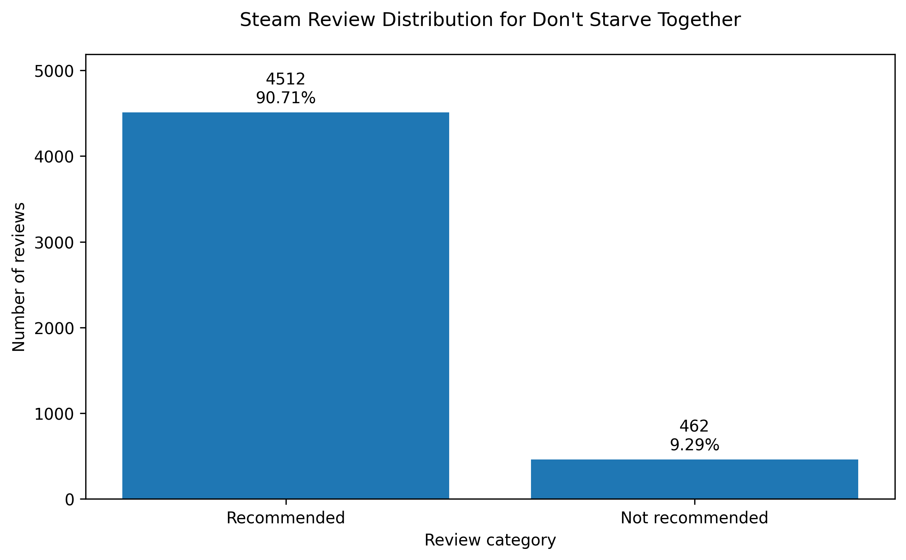

The recommendation labels are strongly imbalanced. Positive reviews account for 90.71% of the sample.

### 2. Monthly Review Activity

Review volume was relatively stable from December 2025 to May 2026. It increased to 890 reviews in June and remained high at 777 reviews in July.

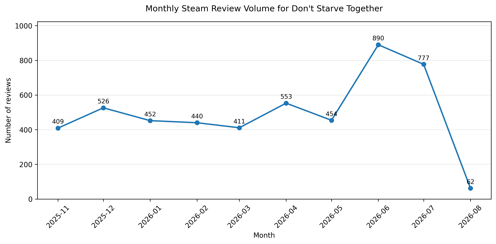

November 2025 and August 2026 are incomplete months and should not be directly compared with complete months.

### 3. Monthly Positive Rate

The positive rate remained close to 90% during most complete months. It declined from 91.1% in April 2026 to 88.9% in July 2026.

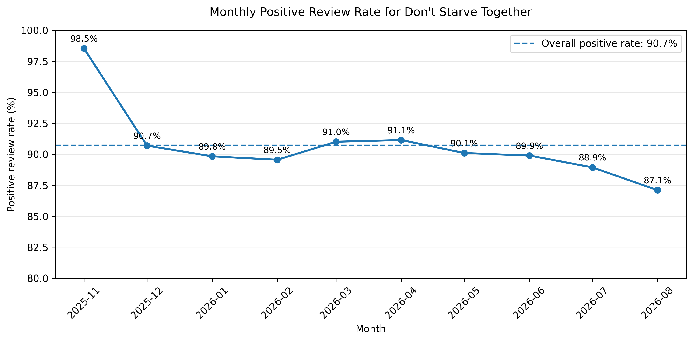

The chart identifies a recent change in review sentiment but does not establish its cause.

### 4. Playtime and Recommendation Behaviour

Positive reviewers had substantially more playtime when submitting their reviews.

| Review category | Median playtime at review |
|---|---:|
| Recommended | 32.84 hours |
| Not recommended | 7.79 hours |

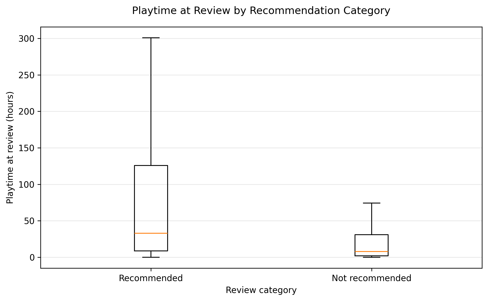

The median playtime of positive reviewers was approximately 4.2 times that of negative reviewers. This suggests that negative feedback was more common during the earlier player experience.

### 5. Review Length

Negative reviews were generally more detailed.

| Review category | Median review length |
|---|---:|
| Recommended | 6 words |
| Not recommended | 13 words |

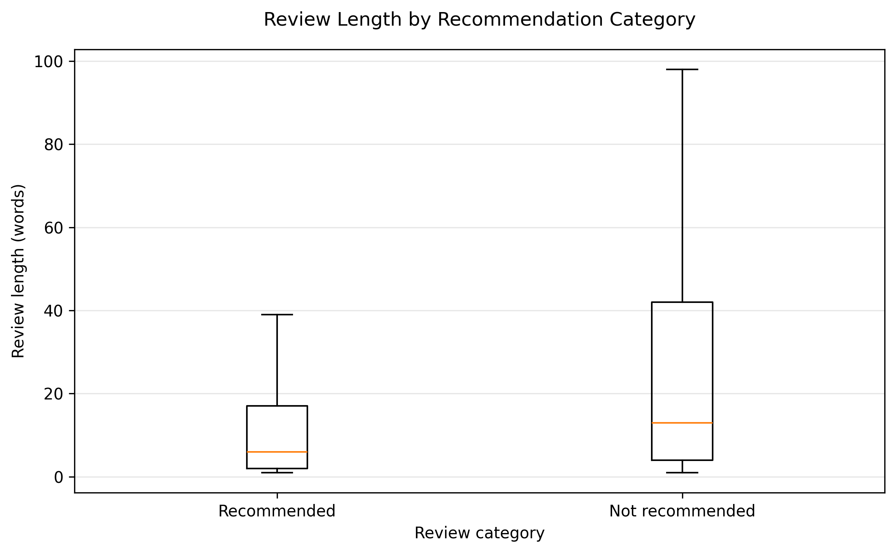

The positive rate also decreased as review length increased.

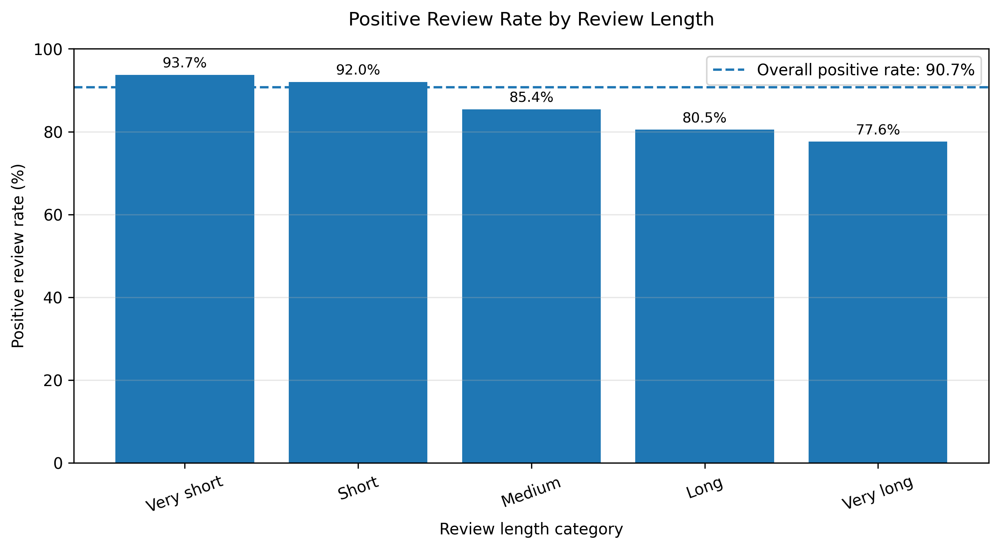

Very short reviews had a positive rate of 93.7%, compared with 77.6% for very long reviews. This is an association and should not be interpreted as a causal relationship.

### 6. Helpful Votes

Negative reviews were more likely to receive at least one helpful vote.

| Review category | Reviews with helpful votes |
|---|---:|
| Recommended | 13.9% |
| Not recommended | 38.5% |

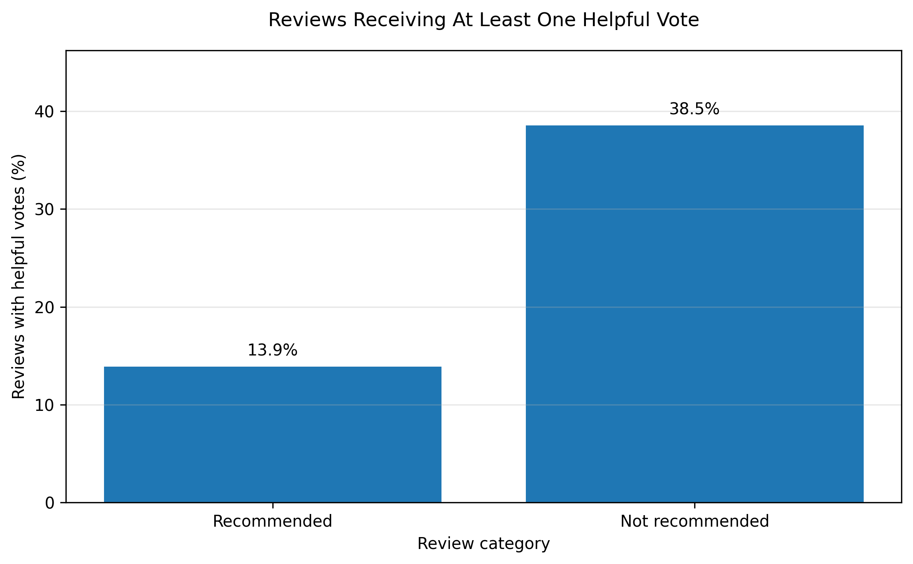

The higher rate may partly reflect the greater length and detail of negative reviews. Review age and visibility may also affect helpful-vote counts.

## Text Theme Analysis

Keyword rules were used to identify major themes in the English review data. A review could contain more than one theme.

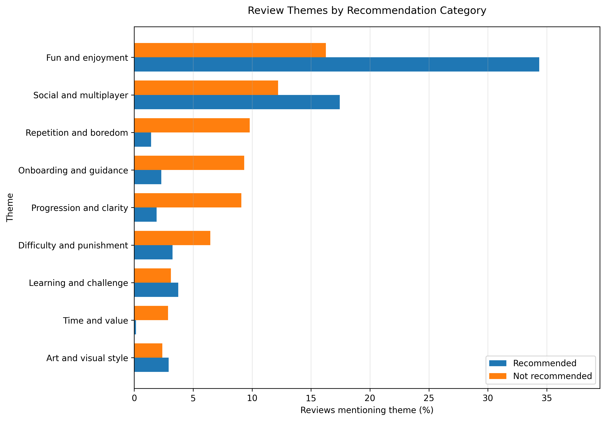

### Positive Themes

The strongest positive themes were:

- Fun and enjoyment: 34.35% of positive reviews
- Social and multiplayer experience: 17.44%
- Learning and challenge: 3.74%
- Art and visual style: 2.93%

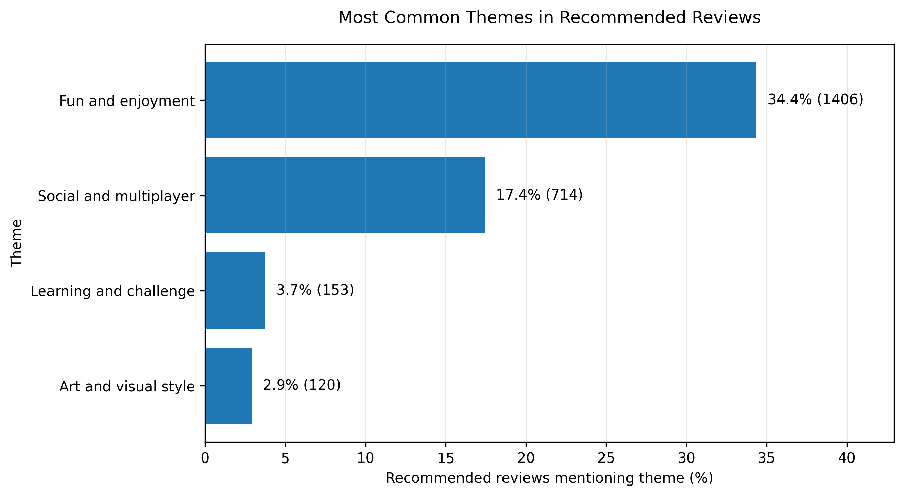

### Negative Issues

The most common issues in negative reviews were:

- Repetition and boredom: 9.81%
- Onboarding and guidance: 9.33%
- Progression and clarity: 9.09%
- Difficulty and punishment: 6.46%
- Time and value: 2.87%

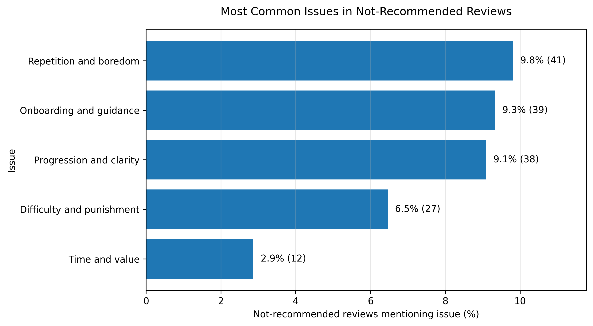

The results suggest that difficulty is not always viewed negatively. Challenge appeared in both positive and negative reviews, while insufficient guidance and unclear progression were more strongly associated with negative feedback.

## SQL Analysis

A SQLite analysis module was added to demonstrate practical SQL skills using the processed English-language review dataset.

The database contains three normalized tables:

- `reviews`
- `themes`
- `review_themes`

The SQL analysis includes:

- Data quality checks
- Monthly review metrics
- Playtime-based review segmentation
- Theme analysis using multi-table joins
- Common Table Expressions
- Conditional aggregation
- Window functions including `LAG`, `RANK`, and `DENSE_RANK`

### Key SQL Findings

The SQL analysis was conducted on 4,511 English-language reviews.

- The overall recommendation rate was 90.73%.
- June 2026 had the highest review volume with 799 reviews.
- Recommendation rate increased from 58.78% among reviews submitted before two hours of playtime to 96.19% among reviews submitted after 200 hours.
- Negative reviews were more strongly associated with repetition, unclear progression, and onboarding problems.
- `Repetition and boredom` had a negative-rate lift of 4.42.
- `Progression and clarity` had a negative-rate lift of 3.54.
- `Onboarding and guidance` had a negative-rate lift of 3.16.

The SQL files are available in the `sql/` directory, while `notebooks/06_sql_analysis.ipynb` presents selected queries and interpretations.

## Statistical Testing

Statistical tests were used to evaluate whether several patterns identified during exploratory analysis were statistically meaningful.

The tests were conducted on the full cleaned dataset of 4,974 reviews.

### Main Results

| Analysis | Test | Result | Effect size |
|---|---|---|---|
| Playtime by recommendation | Mann–Whitney U | p < 0.001 | Rank-biserial = 0.397 |
| Review length by recommendation | Mann–Whitney U | p < 0.001 | Rank-biserial = -0.259 |
| Helpful vote by recommendation | Chi-square | p < 0.001 | Cramér's V = 0.193 |
| Recommendation rate by month | Chi-square | p = 0.916 | Cramér's V = 0.024 |

### Interpretation

Recommended reviews were submitted after a median of 32.84 hours of playtime, compared with 7.79 hours for non-recommended reviews.

Non-recommended reviews were longer, with a median of 13 words compared with 6 words for recommended reviews.

Negative reviews were also more likely to receive at least one helpful vote, with rates of 38.53% and 13.90% respectively.

However, monthly recommendation rates did not differ significantly after incomplete months were excluded. This suggests that visible month-to-month fluctuations should not be interpreted as evidence of a systematic change in player sentiment.

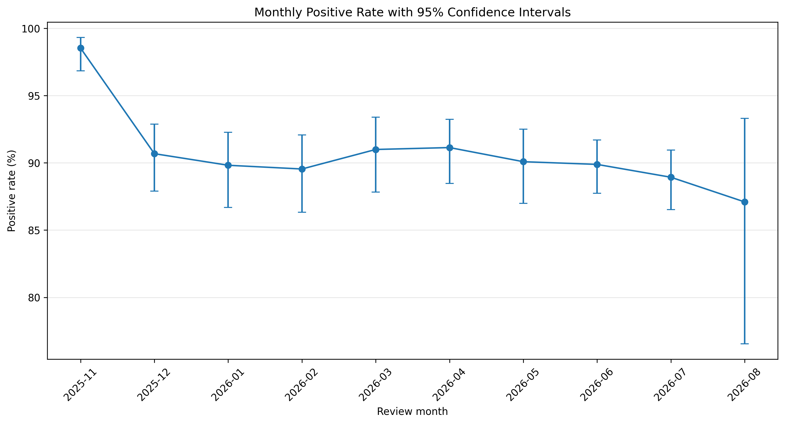

The full statistical analysis is available in `notebooks/07_statistical_testing.ipynb`.

## Text Classification

A TF-IDF logistic regression model was trained to predict whether a review was recommended. A separate training script also compares this model with a majority baseline, Multinomial Naive Bayes, and Linear SVM.

The dataset was split into an 80% training set and a 20% test set using stratified sampling. Balanced class weights were applied because negative reviews were the minority class.

### Model Performance

| Metric | Baseline | TF-IDF Logistic Regression |
|---|---:|---:|
| Accuracy | 0.91 | 0.87 |
| Macro F1 | 0.48 | 0.71 |
| Negative recall | 0.00 | 0.68 |
| Negative F1 | 0.00 | 0.50 |

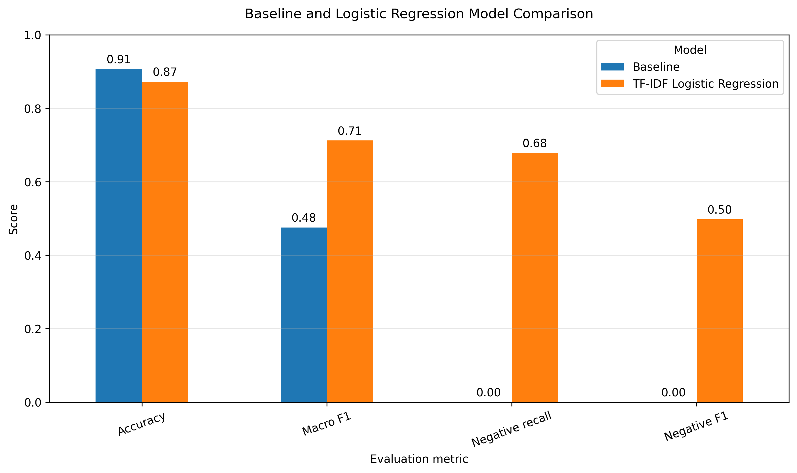

The baseline model achieved high accuracy by predicting every review as positive. It failed to identify any negative reviews.

The logistic regression model correctly identified 57 of the 84 negative reviews in the test set. Its negative recall reached 67.9%, and its macro F1-score increased to 0.712.

In the scripted model comparison, Linear SVM achieved the strongest holdout macro F1 among the tested text models, while Logistic Regression achieved the highest negative-review recall. This trade-off is useful because missing negative reviews is more costly for product-feedback analysis than misclassifying some positive reviews.

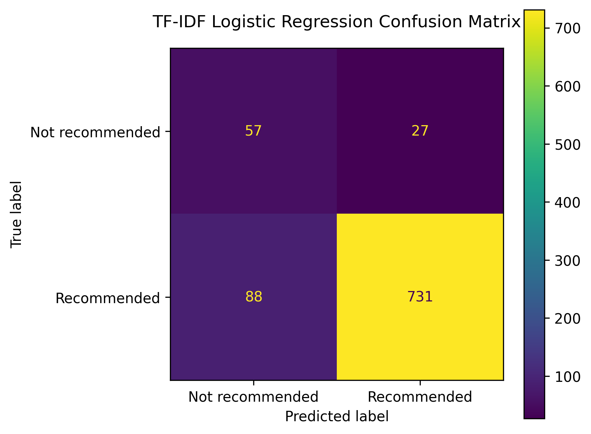

### Model Interpretation

Important positive features included `fun`, `good`, `love`, `friends`, and `great`.

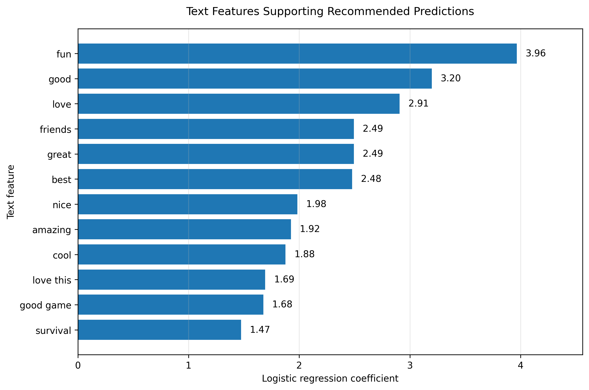

Important negative features included `not`, `boring`, `no`, `trash`, `bad`, and `worst`.

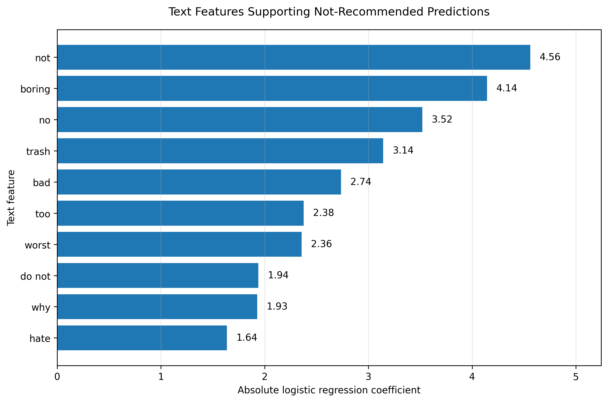

Logistic regression coefficients indicate the direction and relative strength of a text feature. They should not be interpreted as probabilities or causal effects.

## Error Analysis

The model misclassified:

- 88 positive reviews as negative
- 27 negative reviews as positive

Common causes included:

- Very short reviews with limited context
- Mixed positive and negative opinions
- Sarcasm and humour
- Indirect expressions of dissatisfaction
- Review labels that did not match the written text
- Symbols and expressions removed during text preprocessing

The error analysis shows that TF-IDF logistic regression can identify common sentiment expressions but has limited understanding of context, irony, and implicit meaning.

## Project Structure

```text
dst-review-analysis/
├── data/
│   ├── database/
│   ├── processed/
│   └── raw/
├── notebooks/
│   ├── 01_data_quality_check.ipynb
│   ├── 02_data_cleaning.ipynb
│   ├── 03_exploratory_analysis.ipynb
│   ├── 04_text_analysis.ipynb
│   ├── 05_text_classification.ipynb
│   ├── 06_sql_analysis.ipynb
│   └── 07_statistical_testing.ipynb
├── outputs/
│   ├── figures/
│   └── tables/
├── sql/
│   ├── 01_create_tables.sql
│   ├── 02_data_quality_checks.sql
│   ├── 03_monthly_metrics.sql
│   ├── 04_player_segmentation.sql
│   └── 05_theme_analysis.sql
├── src/
│   ├── build_sqlite_database.py
│   ├── collect_reviews.py
│   └── train_models.py
├── .gitignore
├── README.md
└── requirements.txt
```

## Technologies

- Python 3.9
- pandas
- requests
- matplotlib
- scikit-learn
- JupyterLab
- langdetect

## Reproducing the Project

Clone the repository and enter the project directory:

```bash
git clone <repository-url>
cd dst-review-analysis
```

Create and activate a virtual environment:

```bash
python3 -m venv .venv
source .venv/bin/activate
```

Install dependencies:

```bash
python -m pip install -r requirements.txt
```

Collect the Steam reviews with default settings:

```bash
python src/collect_reviews.py
```

The collection script also supports reusable command-line arguments:

```bash
python src/collect_reviews.py \
  --app-id 322330 \
  --target-reviews 5000 \
  --language english \
  --output data/raw/dst_reviews_english_5000.csv
```

Start JupyterLab:

```bash
jupyter lab
```

Run the notebooks in this order:

```text
01_data_quality_check.ipynb
02_data_cleaning.ipynb
03_exploratory_analysis.ipynb
04_text_analysis.ipynb
05_text_classification.ipynb
```

## Scripted Model Reproduction

The modeling step can be reproduced without opening Jupyter:

```bash
python src/train_models.py \
  --input data/processed/dst_reviews_english_text.csv \
  --tables-dir outputs/tables \
  --test-size 0.20 \
  --cv-folds 5
```

This script trains and compares:

- Majority-class baseline
- TF-IDF Multinomial Naive Bayes
- TF-IDF Linear SVM
- TF-IDF Logistic Regression with balanced class weights

It exports:

- `outputs/tables/engineered_model_comparison.csv`
- `outputs/tables/engineered_logistic_regression_report.csv`
- `outputs/tables/engineered_logistic_regression_features.csv`
- `outputs/tables/engineered_misclassified_reviews.csv`

This scripted path makes the classification result easier to reproduce and gives the project a clearer engineering workflow beyond exploratory notebooks.

## Limitations

- The dataset contains recent reviews rather than all historical reviews.
- The first and final months are incomplete.
- Steam language labels do not guarantee that every review is written in English.
- Automatic language detection may misclassify short reviews.
- Rule-based theme analysis depends on manually defined keyword patterns.
- Helpful votes may be affected by review age and visibility.
- The classification model has limited ability to understand sarcasm, humour, and complex context.
- The dataset is strongly imbalanced, with substantially fewer negative reviews.

## Possible Improvements

Future work could include:

- Collecting a larger historical dataset
- Connecting review trends with game update dates
- Comparing reviews across several survival games
- Adding confidence intervals and statistical significance tests
- Testing transformer-based text classification models
- Using topic modelling to identify themes automatically
- Developing an interactive dashboard with Streamlit or Power BI
